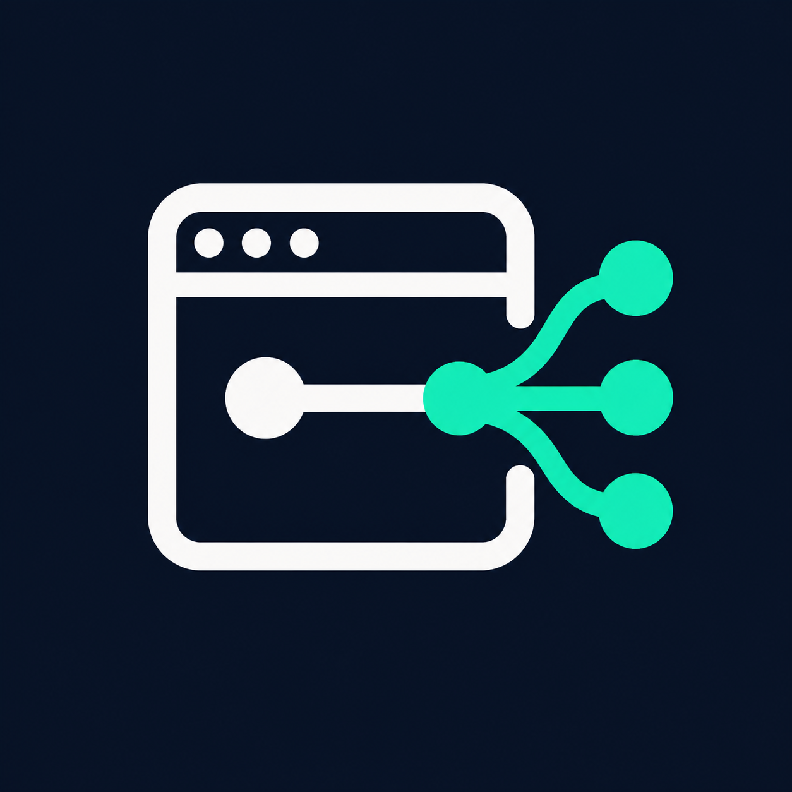

# WebMCP Enable



**A Codex skill for making website workflows callable through browser WebMCP.**

Give Codex a website project or a URL and ask it to expose useful actions—searching a catalog, looking up inventory, or preparing a checkout—as tools. The skill guides discovery, implementation, troubleshooting, and verification while preserving the website's existing behavior.

This is an **instructions-only skill**, not an SDK, browser extension, hosted service, or automatic website converter. It has no runtime dependencies of its own.

## What it supports

| Access | Approach | Result |
| --- | --- | --- |
| Editable source code | Add declarative form annotations or imperative tools around existing application logic | An integration in your website's codebase |
| URL and permitted browser access | Inspect the running page and build a site-specific adapter | A local, session-scoped integration; the hosted website stays unchanged |
| Existing WebMCP integration | Inspect capabilities, registration, discovery, and execution | Targeted fixes and a report of verified behavior |

The skill adapts to the existing stack rather than prescribing a framework. “Any website” is a goal for applicability, not a guarantee: inaccessible functionality, browser support, permissions, and client capabilities can limit what is possible.

## Install in Codex

For personal use, clone this repository into your user skill directory:

```sh
mkdir -p "$HOME/.agents/skills"
git clone https://github.com/skundu42/web-mcp-skill.git \
  "$HOME/.agents/skills/webmcp-enable"
```

The repository **already contains `SKILL.md` at its root**. The resulting entrypoint should be `~/.agents/skills/webmcp-enable/SKILL.md`, with no extra nested skill folder. Review an existing installation rather than overwriting it.

For project-only use, place `SKILL.md`, `agents/`, and `references/` together inside your target project's `.agents/skills/webmcp-enable/` directory instead. Choose one scope to avoid duplicate installations.

Codex detects skill changes automatically; restart it if the skill does not appear. These locations follow the [official skill documentation](https://learn.chatgpt.com/docs/build-skills).

Installing the skill does not enable WebMCP in a browser or connect a browser agent. Real integration testing also requires the relevant browser capabilities and an available consumer. The skill reports missing prerequisites instead of silently installing software or changing settings.

## Use it

Open your website project in Codex, or provide a URL that its browser tools can inspect. Invoke the skill explicitly with `$webmcp-enable`.

**Integrate a website you maintain:**

```text
$webmcp-enable Add WebMCP to this project for product search and cart updates.
Reuse the existing application logic, preserve checkout confirmation,
and test the integration without placing real orders.
```

**Create a local adapter from a URL:**

```text
$webmcp-enable Make catalog search at https://example.com/catalog callable
for this browser session. Do not change the hosted site or install an
extension. Include removal instructions and report anything unverified.
```

Replace the example URL with the actual site you want to use.

**Diagnose an existing integration:**

```text
$webmcp-enable This website registers tools, but my browser agent cannot
discover them. Inspect the integration and fix the failing layer without
weakening permissions.
```

Include the workflows and target browser/client when you know them. Otherwise, Codex inspects what is available and states the scope it can support. Automatic skill selection is also enabled by default.

## What to expect

The skill directs Codex to:

1. **Map the workflows.** Identify existing tools and the forms or application functions behind each requested action.
2. **Check the actual capabilities.** Separate source access, page-side registration, and consumer discovery/invocation; verify the current API contract.
3. **Implement the smallest useful integration.** Reuse validation, authentication, business logic, and UI behavior. Handle cleanup, navigation, cancellation, and partial failures.
4. **Verify and hand off.** Report workflow coverage, changed files, usage and removal instructions, exact checks, and remaining blockers.

A successful button click is not automatically a successful business operation. The guidance covers stale results, loading states, overlapping human actions, and uncertain outcomes so an adapter does not report unfinished work as complete.

## Safety and boundaries

- Keep human review and confirmation for consequential actions. Preparing checkout is not placing an order.
- Preserve authentication, authorization, browser security, and unrelated unsaved edits.
- Keep credentials and unnecessary personal data out of tool schemas, errors, and results.
- Scope adapters to observed workflows and origins; do not expose unrestricted JavaScript or arbitrary authenticated requests.
- Do not automatically replay a mutation whose outcome is uncertain. Cancellation does not undo a committed action.
- Keep URL-only adapters session-local unless persistence is separately requested.

Browser WebMCP is distinct from a conventional HTTP/stdio MCP server. Registering tools does not automatically make them available to every MCP client. See the [WebMCP draft](https://webmachinelearning.github.io/webmcp/) and [Chrome's WebMCP guide](https://developer.chrome.com/docs/ai/webmcp) for the evolving browser platform.

## Validation status

During development, the skill passed structural validation and independent evaluations using temporary fixtures and Node-based mocks. Scenarios covered HTML forms, SPA workflows, registration-only runtimes, unsupported or restricted environments, repeated searches, concurrent activity, and registration cleanup.

**Native-browser and target-agent compatibility have not yet been verified.** The development fixtures are not bundled in this repository, and there is no packaged test suite or CI compatibility matrix.

The skill requires each resulting integration to distinguish its evidence:

| Evidence | Meaning |
| --- | --- |
| Implemented | Integration code has been written |
| Mock-tested | Local logic was exercised with test doubles |
| Native-browser verified | Real browser discovery and invocation were checked |
| Target-agent verified | The intended agent client discovered and invoked the tools |

Mock tests do not establish either of the last two levels. The next validation step is a real source integration and a real URL-only adapter in the intended browser/client environment.

## Repository guide

The skill contents remain directly at the repository root. Listing documents and assets are alongside them:

```text
README.md
SKILL.md
SUPPORT.md
PRIVACY.md
TERMS.md
RELEASE_NOTES.md
LISTING.md
plugin.json
assets/
  logo.png
agents/
  openai.yaml
references/
  source-integration.md
  browser-adapters.md
```

- [SKILL.md](SKILL.md) — shared workflow, capability checks, tool design, and verification requirements.
- [Source integration](references/source-integration.md) — form annotations, application wrappers, lifecycle handling, and diagnostics.
- [Browser adapters](references/browser-adapters.md) — session-local execution, DOM interactions, completion evidence, and teardown.
- [Codex metadata](agents/openai.yaml) — display name, description, and suggested invocation prompt.

`plugin.json` is the release manifest source, not a plugin installed from the repository root. A release copies it to `.codex-plugin/plugin.json`, places the unchanged skill files under `skills/webmcp-enable/`, and includes `assets/logo.png`. Generated ZIPs and expanded bundles stay in the Git-ignored `dist/` directory; creating them does not publish a directory listing.

For improvements or bug reports, see [Support](SUPPORT.md). Read the [privacy notice](PRIVACY.md), [terms of use](TERMS.md), and [release notes](RELEASE_NOTES.md). The [listing worksheet](LISTING.md) records public submission fields and outstanding publisher decisions.
